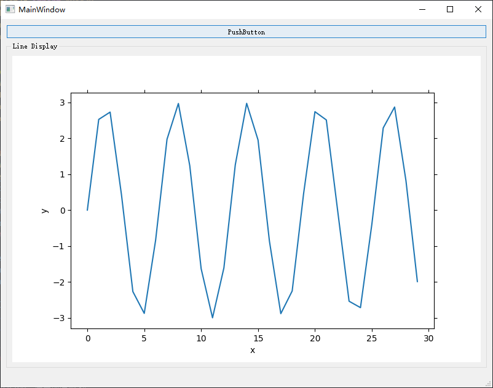
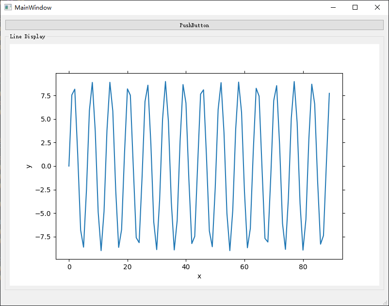

This can achieve re-draw in GUI.

python环境：python 3.8.5

日期：2021.07.01

文件介绍：

* DataDisplay.py：主文件
* DataDisplayUI.ui：是Qt-designer的文件
* Ui_DataDisplayUI.py: 是DataDisplayUI.ui转换后的py文件。

点击下面的pushbutton按钮，可以实现figure的更新，当然这只是一个简单的demo，读者可以在这个思路上面进行修改。

